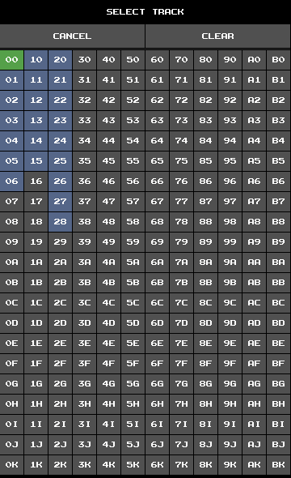

# Fake SID Manual

## 1. Introduction

Fake SID is a C64 music tracker for Android.
It is highly inspired by Linus Åkesson's amazing [Blackbird](https://www.linusakesson.net/software/blackbird/index.php).
The emulation of the SID chip is based on TinySID by Tammo Hinrichs.

The UI is split into a number of views
to which you can switch by pressing the corresponding tab button
on the top of the screen.
Each view deals with one aspect of the music creation.
Let's go through the views and discuss them in more detail.

## 2. MAIN

The **MAIN** view is the default view when you start the app.
Here, you can:
+ set the title and author of the song you are currently editing
+ load, save, and delete songs
+ reset the song data of the current song
+ export songs
+ edit miscellaneous settings

In Fake SID you edit exactly one song at a time.
When the app starts, a very basic song is loaded that contains just one note.
Try it out by pressing the **play** button at the bottom of the screen.
You should hear a short beep.

To load a previously saved song, simply select a song from the song list.
This will enter the song name in the song name input field.
Now press **LOAD**.
Press **SAVE** to save the current song under the name in the input field.
An existing song file of that name will be overwritten.
Change the file name before saving to create a new file.
Press **DELETE** to delete the selected song.
Press **RESET** to reset the current song.

You may render the current song to **WAV** or **OGG**
by first selecting the desired file format and then pressing **EXPORT**.
Song files and exported songs are stored in the directories
`fakesid/songs` and `fakesid/exports` of your phone's internal shared storage.

Fake SID lacks export to SID or any file format native to the C64.
Although the app was not designed with this functionality in mind,
it could in theory be added at some later point in time.

The **MAIN** view is split in two areas – **PROJECT** and **SETTINGS**.
In the **SETTINGS** area, you can toggle background playback
and configure track row highlighting in **TRACK** view.

## 3. SONG

A song in Fake SID is basically a table with one column per voice.
Table entries are references to tracks.
Each row represents a small section of the song (usually 4 measures).
Voices can be muted and unmuted by pressing the relevant buttons in the table header.

Song view|Track select
:-:|:-:
|

The first column shows hexadecimal row numbers.
Press a row number button to select a row.
The tree buttons below the table let you delete the selected row,
insert a new row above the selected row,
and insert a new row below the selected row, respectively.
The selected row also sets the player position if no playback is active,
which is indicated by the yellow row.

The second column specifies the tempo and swing of the song.
As is common with most C64 trackers, time is split into slices of 1/50 of a second, called frames.
**TEMPO** is the number of frames spent per track row.
**SWING** is the number additional frames for even-numbered track rows.
This is useful to create jazzy rhythms.

The other four columns represent the four voices.
Assign a reference to a table cell by touching it.
This will open up the track select screen with all 252 available track references from `00` to `BK`.
Non-empty tracks are highlighted.
Choose the reference you wish to assign, or touch **CLEAR** to clear the table cell.

Press and hold a track reference button to switch into **TRACK** view and see the referenced track.

Just like the view tabs, the bottom row of buttons is accessible from all views.
Besides the **play** and **stop** button,
there are buttons for **fast forwarding/backwarding**
and a button that toggles **loop mode**.
Loop mode causes the player to repeat the current song row indefinitely.

## 4. TRACK

Tracks represent one bar of music for one voice.
Tracks are tables with three columns for instrument references, effect references, and notes, in that order.

The two rows of buttons at the top show references to the most recently used instruments and effects, respectively.
Press the corresponding button to select an instrument or effect.
There are 48 slots for instruments and as many for effects.
Press and hold the **INSTRUMENT** tab to open up the instrument select screen,
which allows you to select an instrument from among all available instruments.
Selecting effects works the same way.

Instrument select|Effect select
:-:|:-:
|

Below, you find the reference of the current track.
Touch it to open up the track select screen.
(Alternatively, you can also touch the **TRACK** tab.)
The arrow buttons let you set the number of rows of the curren track.
Right next to it are buttons for copying and pasting tracks.

The main area of the screen shows the track table and the note matrix.
Use the scrollbars to navigate.
Insert notes by touching the respective cell in the note matrix.
This will also assign the selected instrument and effect to the track row.
Changing notes works the same, except that the rows' instrument and effect references are unaffected.
To clear a row, press the note button.
Press it again to insert a note-off event.
Assign and remove an instrument or effect reference from a track row by pressing the relevant button.
You can also select an instrument or effect from a track row by holding the button.

## 5. INSTRUMENT

Instruments control the volume and waveform of a voice.
They may also control the filter.

The row of buttons on the top shows references to the most recently used instruments.
Selecting instruments works just like in the **TRACK** view.
Below, there is the instrument name input field.
Right next to it are buttons for copying and pasting instruments.

Select the **WAVE** tab to view the instrument's envelope settings and the wavetable.
Select the **FILTER** tab to view the filter table.

### 5.1 WAVE

The sliders labeled **ATTACK**, **DECAY**, **SUSTAIN**, and **RELEASE** let you configure the volume envelope.
The button on the right toggles **hard restart**.
Two frames before an instrument with enabled hard restart is triggered,
the voice's gate is cleared and sustain and release are set to zero,
effectively creating a short pause between notes.

The main area of the screen shows the wavetable.
The wavetable defines how the SID control register and the pulse width are updated over time.
When an instrument is triggered, its wavetable is played, beginning at the top
and progressing to the next row with each frame.
Playback loops after the last row.
Set the loop point by pressing the corresponding row index.
Adding and removing rows from the table works just like in **SONG** view.

The first four buttons of a wavetable row configure the waveform.
They stand for **noise**, **pulse**, **sawtooth**, and **triangle**.
Fake SID combines multiple waveforms by binary AND-ing them.
Note that the SID chip is not emulated correctly in this regard.
The next three buttons stand for **ring modulation**, **hardsync**, and **gate**.
The next button specifies the pulse width command,
together with a slider for the command parameter.
The command button can be toggled between:

Command | Effect
-|-
**`=`** | Set the pulse width to the specified value.
**`+`** | Increase the pulse width by the specified amount.

Note that only the pulse wave is affected by the pulse width.

### 5.2 FILTER

Just like the original SID chip, Fake SID has one global filter.
Filter parameters are controlled via filter tables.
An instrument's non-empty filter table gets activated any time the instrument is triggered,
replacing the previously active filter table.
Note, that a filter table may remain active even after the instrument that triggered it is not playing anymore.

The four buttons above the filter table toggle filter routing for each voice.
The filter routing configuration is applied with the filter table,
meaning it only takes effect if there's at least one row in the table.

As with wavetables, one row represents one frame.
Setting the loop point and adding and removing rows works the same.

The first three buttons of a filter table row configure the filter type.
They stand for low-pass, band-pass, and high-pass.
The slider next the them sets the resonance.
The next button specifies the cut-off frequency command,
together with a slider for the command parameter.
The command button can be toggled between:

Command | Effect
-|-
**`=`** | Set the cut-off frequency to the value.
**`+`** | Increase the cut-off frequency by some amount.
**`-`** | Decrease the cut-off frequency by some amount.

## 6. EFFECT

Effects modify the pitch of a voice.
They are useful to create arpeggios, vibrato, and percussion sounds.

The row of buttons on the shows lists references to the most recently used effects.
Selecting effects works just like in the **TRACK** view.
Below, there is the effect name input field.
Right next to it are buttons for copying and pasting effects.

As with wavetables, one row represents one frame.
Setting the loop point and adding and removing rows works the same.

Each effect table row has a button that specifies the pitch command,
as well as a slider for the command parameter.
The command button can be toggled between:

Command | Effect
-|-
**`+`** | Set a voice's pitch offset in semitones. The actual pitch of a voice is the sum of this offset and the pitch of the most recent track note.
**`~`** | Works similarly except that the unit is 1/4 of a semitone, which is useful for vibrato and pitch slides.
**`=`** | Set the absolute pitch, ignoring the note pitch.

## 7. JAM

Play notes live by touching the note matrix.
Selecting instruments and effects works just like in **TRACK** view.
Jamming uses the fourth voice,
so expect collisions when there are track notes playing on the fourth voice.

