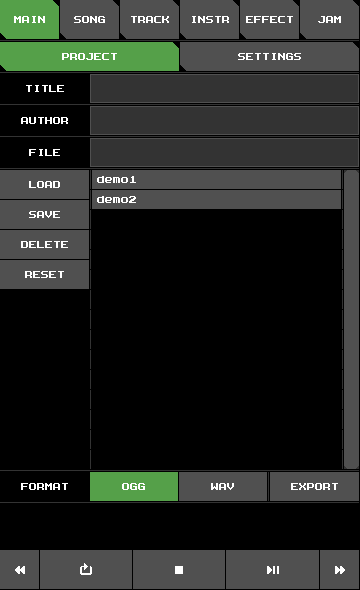
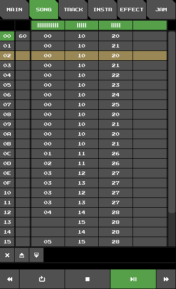

# Fake SID Tutorial

## 1. Introduction

As with all trackers, it may require some time to get familiar with all the ins and outs.
If you already have experience with other trackers (especially C64 ones),
the transition should not be too hard.
But maybe this is your first time encountering a music tracker.
Maybe you just installed Fake SID on your phone
and are excited to create your very first chiptune.
But after starting up the app, you feel overwhelmed and have no idea what is going on.
Do not despair!
This little tutorial will help you get started.

## 2. Playing Songs

After startup, things should look just like shown in the image below.
Notice the row of buttons at the top of the screen.
These are tabs to all the different views and each view deals with one aspect of the music creation.

Currently, we are looking at the **MAIN** view.

Let us now load and play one of two demos songs that Fake SID comes with.
Touch where it says **demo1** to select the file from the list of available song files.
Notice how the text input field next to the label **FILE** now reads **demo1**.
Next, touch **LOAD** to load the selected file.
A dialog pops up, asking for permission to overwrite the current song.
Press **OK** to confirm.
The song is now loaded.
Not press **play** at the bottom of the screen and enjoy.
Note that the song will loop indefinitely, so don't wait for it to finish.

Just like the view tabs, the bottom row of buttons is accessible from all views.
Besides the **play** and **stop** buttons,
there are buttons for **fast forwarding/backwarding**
and a button that toggles **loop mode**.
These buttons will make more sense in **SONG** view.
Let us switch to it by pressing the corresponding tab button.

**SONG** view shows you a big table.
Each row represents a small section of the song (usually 4 measures).
The yellow row the the part of the song that is currently playing.
Let's play around with the **fast forward/backward** buttons.
Notice how the yellow line jumps to the next/previous row.

## 3. Jamming

+ reset song
+ switch to **JAM** view and play on the clavier
+ explain instrument and effect cache

+ create new instrument
+ create arpeggio effect

