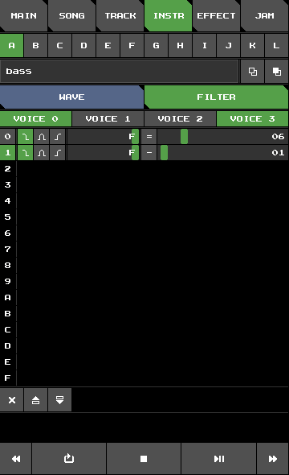

# Fake SID Tutorial – A Basic Song

## The Bass

Let's start by creating a nice bass instrument.
Open Fake SID, switch to **INSTRUMENT** view,
and configure instrument **`A`** like so:

Wave|Filter
:-:|:-:
|

Here is a brief explanation for the reasoning behind these settings:

+ **Envelope:**
We turn everything down except sustain.
This way, sustain effectively controls the instrument's volume.
Also, we want hard restart enabled, so we can clearly hear,
when a new note starts.
+ **Wave:**
We start off with a pulse wave of relatively narrow width
and we want the width to increase over time.
+ **Filter:**
The bass gets a low-pass filter. We start off with a rather low cutoff frequency and let it drop even further down over time.
+ **Filter routing:**
We will put the bassline on the first voice.
But we also want to play around with the bass in **JAM** view.
So we enable the filter for voices 0 and 3.

Switch to **EFFECT** view
and delete the two rows of effect **`A`**. Rename it to `bass`.
Finally, switch to **JAM** view and play some notes to hear the sound of your bass instrument.

## The Bass Track

Switch to **TRACK** view.
Make sure, track `00` is selected.
Enter notes like so:

Track view|Notes
:-:|:-:
||

You can press **play** to listen to our bassline.
Let's change its tempo.
Switch to **SONG** view and set the tempo and swing of row `00` to
`A2`.
It should look like this:

