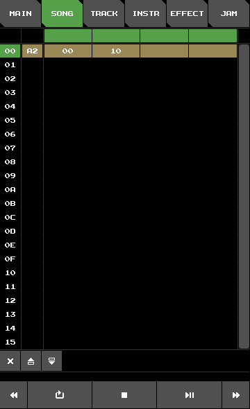

# Fake SID Tutorial – A Basic Song

## Bass

Let's start by creating a nice bass instrument.
Open Fake SID, switch to **INSTRUMENT** view,
and configure instrument **`A`** like so:

Wave|Filter
:-:|:-:
|

Here is a brief explanation for my reasoning behind these settings:

+ **Envelope:**
We turn everything down except sustain.
This way, sustain effectively controls the instrument's volume.
Also, we want hard restart enabled, so we can clearly hear,
when a new note starts.
+ **Wavetable:**
We start off with a pulse wave of relatively narrow width
and we want the width to increase over time.
+ **Filter routing:**
We will put the bassline on the first voice.
But we also want to play around with the bass in **JAM** view.
So we enable the filter for voices 0 and 3.
+ **Filter table:**
The bass gets a low-pass filter. We start off with a rather low cutoff frequency and let it drop even further down over time.

Switch to **EFFECT** view
and delete the two rows of effect **`A`**. Rename it to `bass`.
Finally, switch to **JAM** view and play some notes to hear the sound of your bass instrument.

Switch to **TRACK** view.
Make sure, track `00` is selected.
Enter notes like so:

Track view|Notes
:-:|:-:
|

You can press **play** to listen to our bassline.
Let's make the song a little slower.
Switch to **SONG** view and set the tempo and swing of row `00` to
`A2`.
It should look like this:

Tempo select|Song view
:-:|:-:
|

This is how it should sound:
[tut_0.ogg](https://raw.githubusercontent.com/2bt/fakesid/master/docs/tut-01/tut_0.ogg)

At this point, it's a good idea to save our song.
Switch to **MAIN** view and
set the song title and, file name.
Then hit **SAVE**.
Notice the new file in the song file list.

## Arpeggios

Let's add a second instrument and create some arpeggio effects to go with it:

Instrument|Effect 1|Effect 2|Effect 3
:-:|:-:|:-:|:-:
|||

We use **`H`** for the instrument and **`H`**, **`I`**, and **`J`** for the three effects.
Having configured the first effect,
there is a nice opportunity to employ the copy and paste functionality.
We copy the effect with the **copy** button,
then switch to effect **`I`** and press the **paste** button.
Now we only need to do a few adjustments.
We proceed with effect **`J`** in like manner.

Notice that we select both pulse and triangle wave to be played simultaneously.
How does that work?
The SID chip will *somehow* combine these two waveforms, effectively multiplying them.
The result will generally be more quiet,
the pulse width affecting the overall volume.
I arrived at these settings after some experimentation.
(Please note that combining of waveforms is one aspect of the SID emulation, that is not at all emulated correctly.)

It's time to add a new track into the song.
Switch over to **SONG** view.
and set the track reference on the second voice on row `00` to `10`.

Track select|Song view
:-:|:-:
|

We could now manually switch to **TRACK** view and select the track reference there again
but there is a shortcut for this:
Press and hold the track reference button you just pressed to set it to `10`.
Now, enter notes like so:

Track view|Notes
:-:|:-:
|

Press **play**. It should sound like this:
[tut_1.ogg](https://raw.githubusercontent.com/2bt/fakesid/master/docs/tut-01/tut_1.ogg)

Again, don't forget to save your work.

## Snare and Kick

Let's add a snare drum.
We set up an instrument-effect pair like shown below.
Feel free to experiment and play around with the settings.

Wave|Filter|Effect
:-:|:-:|:-:
||

Conveniently, we won't have the bass und the snare drum play simultaneously,
so we can add the snare to our bassline
and save the third voice for the melody.

Track view|Notes
:-:|:-:
|

TODO: kick

## Melody

TODO