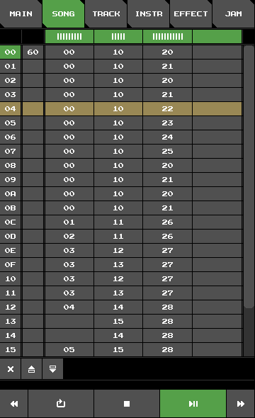

# Fake SID Tutorial

## 1. Introduction

Trackers are special programs for music creation.
There are many great trackers for the C64 out there,
but running them requires either the real hardware,
or an emulator like VICE.
A few cross-platform trackers exist which run on PC,
GoatTracker being probably the most popular.

Fake SID, on the other hand, is a C64 music tracker for Android.
It is highly inspired by Linus Åkesson's [Blackbird](https://www.linusakesson.net/software/blackbird/index.php).
As with all trackers, the UI may require some time to get used to.
If you are already familiar with other trackers (especially C64 ones),
the transition should not be too hard.

But maybe this is your first time encountering a music tracker.
Maybe you just installed Fake SID on your phone
and are excited to create your very first chiptune.
But after starting up the app, you feel overwhelmed and have no idea what is going on.
Do not despair!
This little tutorial is exactly for you.

## 2. Playing Songs

After startup, things should look just like shown in the image on the right.
Notice the row of buttons on the top of the screen.
These are tabs to all the different views and each view deals with one aspect of the song creation.

Currently, we are looking at the **MAIN** view.
Here, you can:
+ set the title and author of the song you are currently editing
+ load, save, and delete songs
+ reset the song data of the current song
+ export a song to OGG or WAV

In Fake SID you edit exactly one song at a time.
When the app starts, a very basic song is loaded that just plays one note.
Try it out by pressing the **play** button at the bottom of the screen.
You should hear a short beep.

Let us now load and play one of two demos songs that Fake SID comes with.
Touch where it says **demo1** to select the file from the list of available song files.
Notice how the text input field next to the label **FILE** now reads **demo1**.
Next, touch **LOAD** to load the selected file.
A dialog pops up, asking for permission to overwrite the current song.
Press **OK** to confirm.
The song is now loaded.
Finally, press **play** and enjoy.

Let us switch to **SONG** view by pressing the corresponding tab button at the top.

The bottom row of buttons is accessible from all views.
Besides the **play** and **stop** buttons,
there are buttons for fast forwarding/backwarding
and a button that toggles loop mode.
These buttons will make more sense in **SONG** view.

+ explain song view

## 3. Jamming

+ reset song
+ switch to **JAM** view and play on the clavier
+ explain instrument and effect cache

+ create new instrument
+ create arpeggio effect

## 4. Your First Own Song

The text input fields for **TITLE** and **AUTHOR**

Song files are stored in the directory `fakesid/songs` of your phone's internal shared storage.

# X. Song Export

Fake SID lacks export to SID or any file format native to the C64.
Although the app was not designed with this functionality in mind,
it could be added in some later point in time.

Exported songs are stored in the directory `fakesid/exports` of your phone's internal shared storage.

## X. Tips

+ ...
+ ...
+ ...